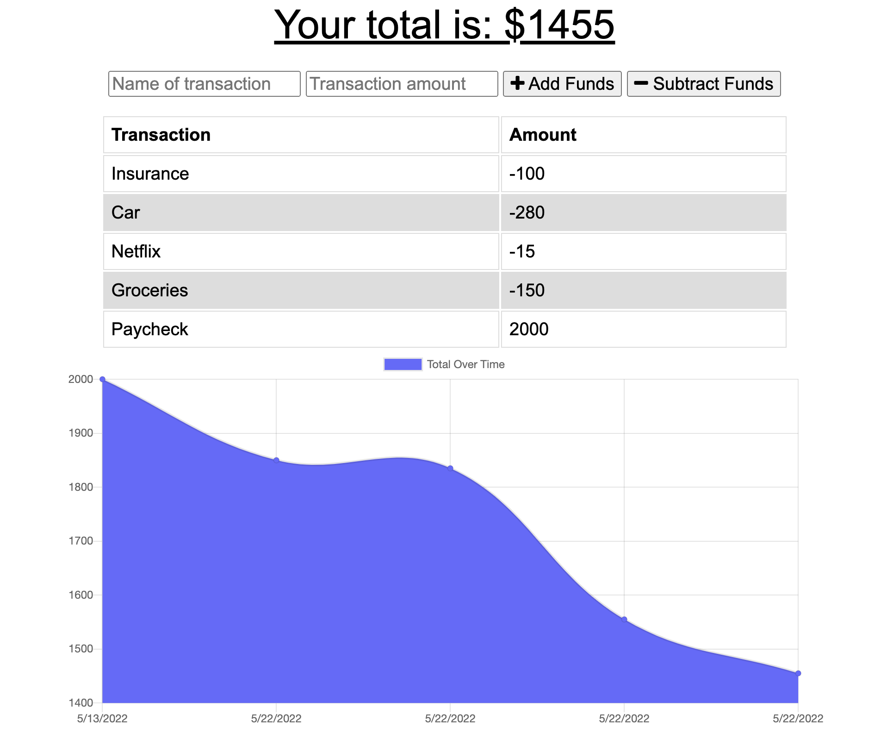

# Track My Budget

Track My Budget is a tool that allows you to track your budget and has both online and offline capabilities.

## Installation

To run this app on your local machine, you will want to clone this repository and install MongoDB and Node. Then, open your terminal and type in "npm install" to install npm packages. You can use Track My Budget as an app if you download it through Chrome and run it locally.

## Usage

## Technologies

* Javascript
* IndexedDB
* MongoDB
* Node.js
* Mongoose

## Contributers

* Brandon Henry
